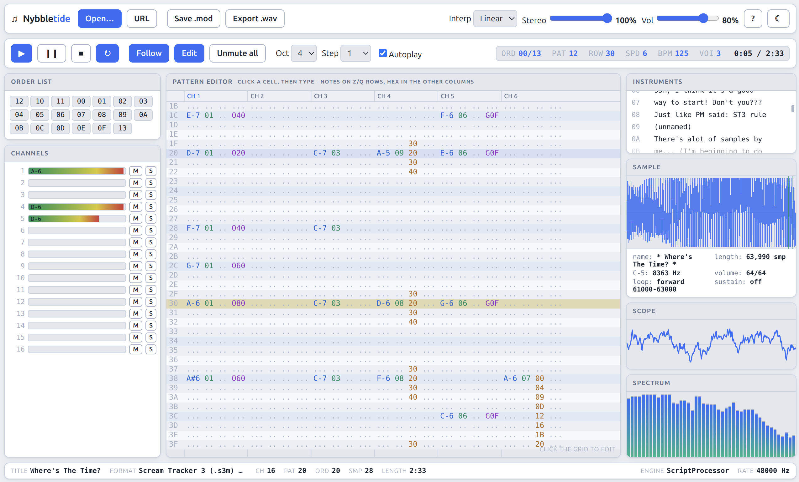

# Nybbletide

**A MOD / S3M / XM / IT module player *and* pattern editor that runs entirely in your browser — in a single `index.html` file.**

**[▶ Try it live](https://g023.neocities.org/nybbletide_tracker/)** · **[Official repository](https://github.com/g023/nybbletide_tracker)**



No install, no build step to use it, no server-side code, no uploads. Drop the folder on any static host (or open `index.html` from disk) and it just runs. Every byte of audio decoding, mixing and rendering happens locally in the browser.

```
nybbletide/
├── index.html        ← the whole application (~370 KB, self-contained)
├── src/              ← the readable sources it is built from
├── tools/            ← build script + regression harnesses (Node)
├── testdata/         ← sample modules used by the test harnesses
├── LICENSE
└── README.md
```

*Nybbletide* — a **nybble** is the four-bit unit the 8-bit and Amiga demoscene was built out of, and a **tide** is what a waveform does. The name is deliberately one no other project has taken.

By **g023** — [github.com/g023](https://github.com/g023) · [x.com/g023dev](https://x.com/g023dev). MIT licensed.

---

## Table of contents

- [What it does](#what-it-does)
- [Quick start](#quick-start)
- [Format support](#format-support)
- [Opening archives](#opening-archives)
- [The interface](#the-interface)
- [Starting a new song](#starting-a-new-song)
- [Song properties](#song-properties)
- [Editing patterns](#editing-patterns)
- [Keyboard reference](#keyboard-reference)
- [Exporting](#exporting)
- [Loading modules from a URL](#loading-modules-from-a-url)
- [Architecture](#architecture)
  - [Why one file, and how the AudioWorklet still works](#why-one-file-and-how-the-audioworklet-still-works)
  - [Four parsers, one song model, one replay engine](#four-parsers-one-song-model-one-replay-engine)
  - [The unified period scale](#the-unified-period-scale)
  - [The canonical effect table](#the-canonical-effect-table)
  - [The mixer and the voice pool](#the-mixer-and-the-voice-pool)
  - [Why the pattern grid is a canvas](#why-the-pattern-grid-is-a-canvas)
  - [Data flow and the two golden rules](#data-flow-and-the-two-golden-rules)
- [Building from source](#building-from-source)
- [Tests](#tests)
- [Browser support](#browser-support)
- [Known limitations](#known-limitations)
- [A short glossary for non-trackers](#a-short-glossary-for-non-trackers)
- [License](#license)

---

## What it does

**As a player**

- Loads `.mod`, `.s3m`, `.xm` and `.it` modules by drag-and-drop, file picker, or URL.
- Opens them **straight out of an archive** — ZIP, ARJ, LHA/LZH, gzip and tar, unpacked in the page by decompressors written from scratch for this program. Scene modules have been distributed packed for thirty years; you should not have to unpack them first.
- Play / pause / stop / loop transport with an accurate elapsed-time and total-length readout.
- Live pattern and order visualisation — the playing row is highlighted and the view scrolls with it, the order list highlights the playing position.
- An oscilloscope and a log-spaced spectrum analyser fed by a real `AnalyserNode`.
- Per-channel VU meters that also show the note currently sounding on that channel, with **mute** and **solo** on every channel.
- Adjustable master volume, stereo separation (0 % mono … 100 % full Amiga-style separation) and sample interpolation (none / linear / cubic).

**As an editor**

- **Start a song from nothing** — a three-step wizard picks the format, the timing and the instruments, generates a playable sample kit in the browser, and can write a starter groove into the first pattern so there is something to hear the moment it opens.
- **Edit the metadata of any song**, loaded or created: title, tracker name, embedded message, initial speed and tempo, global and mix volume, restart position, the linear-slide and Amiga-limit flags, and the channel count.
- A full pattern grid: note, instrument, volume-column and effect fields, all clickable and typeable.
- Tracker-standard piano-key entry over two octaves, with a selectable base octave and edit step.
- Undo / redo (200 levels) for every pattern mutation.
- An instrument / sample list; clicking an entry draws its **waveform** with the loop region shaded, plus name, length, C-5 rate, volume, loop and (for IT/XM) envelope and NNA details. Double-click auditions it.
- **Save `.mod`** — writes a valid 31-instrument ProTracker module from the in-memory song, whatever format you started from, and tells you exactly what had to be dropped in the conversion before you commit to the download.
- **Export `.wav`** — offline-renders the whole song to 16-bit stereo PCM, faster than real time, honouring your mutes and solos.

**As a program**

- Everything in one `index.html`. Light and dark themes with a toggle that remembers your choice. Audio runs on its own thread.

---

## Quick start

The quickest start of all: **[open the live example](https://g023.neocities.org/nybbletide_tracker/)** — nothing to download.

To run your own copy:

1. Copy the folder to any web server, or just open `index.html` directly (`file://` works too — nothing is fetched over the network).
2. Drag a module onto the window, or press <kbd>Ctrl</kbd>+<kbd>O</kbd>.
3. It plays. Press <kbd>F1</kbd> for the key map.

To try it immediately, there are 30 modules of all four formats in `testdata/`.

> **Autoplay note.** Browsers will not start an `AudioContext` before you interact with the page. Dropping a file or clicking anything counts as interaction, so in practice loading a module always works; if you deep-link with `?mod=` you may need one click on ▶.

---

## Format support

| Format | Extension | Origin | What is supported |
|---|---|---|---|
| ProTracker / Amiga module | `.mod` | Ultimate Soundtracker → ProTracker | 4/6/8+ channel variants (`M.K.`, `M!K!`, `FLT4`, `FLT8`, `xCHN`, `xxCH`, `CD81`, `OCTA`…), 15- and 31-sample layouts, Amiga period table, Amiga frequency limits, ProTracker volume-slide and E-command quirks |
| Scream Tracker 3 | `.s3m` | Scream Tracker 3 | Adlib headers are recognised and skipped (they are silent), stereo/mono flag, ST3 `Gxx`/`Exx`/`Fxx` semantics, ST3 volume-slide-on-tick-0 quirk, per-channel pan |
| FastTracker II | `.xm` | FastTracker II | Instrument layer with 96-key sample maps, volume & panning envelopes with sustain/loop points, vibrato/fadeout, linear *and* Amiga frequency tables, packed pattern rows, 16-bit delta samples, XM volume-column commands |
| Impulse Tracker | `.it` | Impulse Tracker | Instrument mode and sample mode, IT compression (8- and 16-bit, both IT 2.14 variants), NNA / DCT / DCA with a background voice pool, envelopes with carry, `Sxx` sub-commands, `Old Effects` and `Compatible Gxx` flags, channel pan/volume, MIDI/pattern-loop edge cases |

All four are parsed into **one** internal song model, so the player, the editor, the exporter and the visualisers only ever have to understand one thing.

---

## Opening archives

Drop a `.zip`, `.arj`, `.lzh`, `.tar` or `.gz` on the window (or pick it, or deep-link it with `?mod=`) and it is unpacked in the page. Nothing is uploaded, no library is loaded, no request is made — the decompressors are part of the same single file as everything else.

| Container | Extensions | Compression understood |
|---|---|---|
| ZIP | `.zip` | stored (0) and deflate (8); ZIP64 central directories; UTF-8 and CP437 names |
| ARJ | `.arj` | stored (m0), LZH-style m1/m2/m3, and the fixed-code m4 |
| LHA / LZH | `.lha`, `.lzh` | `-lh0-`/`-lhd-` stored, `-lh4-`, `-lh5-`, `-lh6-`, `-lh7-`; header levels 0, 1 and 2 |
| gzip | `.gz`, `.tgz` | deflate, single member |
| tar | `.tar`, `.tar.gz`, `.tgz` | ustar, plus tar inside gzip |

**What happens when you drop one**

- **One module inside** → it loads immediately, and the status line says which member came out of which archive (`Loaded elysium.xm from pack.zip — FastTracker II (.xm)`).
- **Several files inside** → a picker lists every member with its size and compression method. Names that look like modules are sorted first and accented, so a pack of forty files with three modules in it is still one click. Rows are fully keyboard-driven — arrows and <kbd>Home</kbd>/<kbd>End</kbd> move the highlight, <kbd>Enter</kbd> loads.
- **Nothing playable inside** → it says so, rather than failing silently.

Format detection is by *content*, not by extension, in both directions: a `.zip` that is really an ARJ still opens, and — the case that actually matters — a bare module is never mistaken for an archive. The test suite asserts that on all 30 modules in `testdata/`.

**Deliberately not supported**

- **Encrypted members.** Password-protected ZIP and "garbled" ARJ entries are detected and refused with a clear message, not attempted.
- **Multi-volume archives, ZIP methods other than store/deflate** (bzip2, LZMA, XZ), and **ARC/ZOO/RAR/7z**. Each is a different decompressor; the ones above cover essentially every module pack in circulation.
- **Nested archives.** A ZIP inside a ZIP is listed but not recursed into.

The whole implementation lives in `src/js/formats/archive.js` (~700 lines): a raw DEFLATE inflater, the LZH engine shared by LHA and ARJ m1–m3, the ARJ m4 fixed-code decoder, CRC-16/CRC-32, and the container parsers. It exposes `TM.detectArchive(bytes)` and `TM.listArchive(buffer, filename)`, whose entries carry a lazy `extract()` so nothing is decompressed until you choose it.

---

## The interface

```
┌──────────────────────────────────────────────────────────────────────────────┐
│ toolbar  New · Open · URL · Song… · Save .mod · Export .wav  Interp Stereo Vol ? ☾ │
├──────────────────────────────────────────────────────────────────────────────┤
│ transport ▶ ⏸ ■ ↻ · Follow · Edit · Unmute all · Oct · Step · Autoplay │ ord/pat/row/spd/bpm/voi/time │
├───────────────┬──────────────────────────────────────┬───────────────────────┤
│ Order list    │                                      │ Instruments           │
│ (click = jump)│         Pattern editor               ├───────────────────────┤
├───────────────┤            (canvas)                  │ Sample + waveform     │
│ Channels      │                                      ├───────────────────────┤
│ VU · M · S    │                                      │ Scope                 │
│               │                                      ├───────────────────────┤
│               │                                      │ Spectrum              │
├───────────────┴──────────────────────────────────────┴───────────────────────┤
│ status  title · format · ch · pat · ord · smp · length     engine · rate      │
└──────────────────────────────────────────────────────────────────────────────┘
```

- **Order list** — one chip per order entry; the playing one glows. Click a chip to jump the song there.
- **Channels** — a meter per channel showing its current amplitude and the note it is playing. `M` mutes, `S` solos (solo is additive: solo several channels to hear just those). *Unmute all* clears everything. Clicking a channel header in the pattern grid also toggles its mute.
- **Pattern editor** — the current pattern, with the playing row highlighted and beat rows (every 4th and 16th) tinted so you can keep your place. It follows playback while **Follow** is on.
- **Instruments** — every instrument (or sample, in sample-mode formats) with its index and name. The app opens on the first entry that actually contains audio, because slot 1 in a released module is very often a zero-length "sample" holding the author's greetings.
- **Sample** — the selected sample's waveform (min/max envelope per pixel column, so short transients stay visible), the loop region shaded behind it with start/end markers, and the numeric details underneath.
- **Scope / Spectrum** — `AnalyserNode` output. The scope uses rising zero-crossing triggering so the waveform stands still instead of crawling; the spectrum is log-spaced from 40 Hz to 18 kHz with falling peak-hold markers.
- **Status bar** — module metadata on the left, transient messages in the middle, and on the right whether you got the **AudioWorklet** or the **ScriptProcessor** fallback, plus the actual device sample rate.

**Themes.** ☾ / ☀ in the toolbar toggles light and dark. The choice is stored in `localStorage`; with no stored choice the page follows your OS `prefers-color-scheme`. Canvas colours are re-read from the CSS custom properties on every switch, so the grid, waveform and scopes re-theme too.

---

## Starting a new song

You do not need a module to begin. **New…** in the toolbar (<kbd>Ctrl</kbd>+<kbd>N</kbd>, or <kbd>Alt</kbd>+<kbd>N</kbd> where the browser keeps Ctrl+N for itself) opens a three-step wizard. If you already have unsaved edits it asks before replacing them.

**Step 1 — Format.** Song title, target format, channel count, rows per pattern and how many patterns to create. The format drives the rest of the form live: pick MOD and the row count locks to 64 and the channel ceiling drops, pick IT and you may go up to 64 channels. Out-of-range numbers are clamped rather than rejected, so you can never get stuck on a validation error.

**Step 2 — Timing.** Initial speed (ticks per row), tempo (BPM) and global volume, with a running estimate underneath: how long one row lasts in milliseconds and roughly how long the whole song will run. The defaults — speed 6 at 125 BPM — are the Amiga-standard 50 Hz tick.

**Step 3 — Instruments.** A checkbox card per starter instrument, plus the number of blank slots to leave for your own samples and a switch for the starter groove.

The seven starter instruments are **synthesised in the page**, not embedded as data:

| | | |
|---|---|---|
| Sine Lead | Square Lead | pure and hollow chip leads |
| Saw Bass | Triangle | the classic buzzy bass, and a soft pad to sit under it |
| Kick | Snare · Hi-Hat | a sine-sweep drum, and noise-based percussion |

The tonal waves are a single 16-sample cycle on a forward loop; the drums are one-shots built from a seeded pseudo-random generator, so two runs produce byte-identical samples and your `.wav` and `.mod` exports are reproducible. Everything is generated at **8363 Hz**, the reference rate this program tunes C-5 to, which means a new song exports to `.mod` with no resampling, no finetune fudging and not one warning from the exporter.

With **Starter groove** on, pattern 00 gets a kick on every 4th row, a snare on the backbeat, hats on the offbeat and a four-note bass line — deliberately written no lower than C-4, the bottom of the ProTracker period table, so the groove survives a `.mod` export untransposed. Press **Create song** and it loads exactly as a dropped file would: the grid, order list, channel strip and instrument list all rebuild, and with **Autoplay** on it starts playing.

Pressing <kbd>Enter</kbd> on any step advances it, so three Enters give you a playable 4-channel MOD. **Back** never loses an answer — each step re-renders from the same state object.

---

## Song properties

**Song…** in the toolbar (<kbd>Ctrl</kbd>+<kbd>P</kbd> / <kbd>Alt</kbd>+<kbd>P</kbd>) edits the metadata of **whatever song is loaded**, whether it came from disk, from an archive, from a URL or out of the wizard.

| Field | Notes |
|---|---|
| Title | The `.mod` exporter keeps the first 20 characters |
| Tracker | Free text, shown beside the format in the status bar |
| Message | Multi-line liner notes; stored by XM and IT, ignored by MOD and S3M |
| Initial speed / tempo | Ticks per row (1–31) and BPM (32–255) |
| Global volume / mix volume | 0–128 each; drop the mix volume if a loud song clips |
| Restart position | The order the song loops back to |
| Linear slides | On for XM/IT, off for the Amiga-period formats |
| Amiga limits | Clamps periods to the Paula range |
| Channels | Adding appends empty channels; removing discards their notes |
| Add patterns | Appends blank patterns to the end of the song, each with its own order entry |

Speed, tempo, volumes and the flags are only read when the replay engine takes a song, so applying changes hands the whole song back to the audio thread. The dialog saves and restores the playing position and mute/solo state around that, so a change you make while the song is playing does not stop it.

**Add patterns** exists because there is no order-list editor: each appended pattern automatically gets an order entry, so it is reachable the moment you close the dialog. Patterns are only ever added here, never removed.

**Changing the channel count** is the one destructive edit here, and pattern undo does not cover it: shrinking rewrites every pattern. So the dialog checks whether the channels about to disappear actually contain notes, and only then asks for confirmation. Cutting empty channels applies immediately without nagging. Growing is always safe — new channels arrive blank, with sensible default panning for the format.

---

## Editing patterns

Click any cell to put the cursor there. The cursor lives in one of four column groups, and each group has its own input rules:

| Column | Shows | Type |
|---|---|---|
| Note | `C-5`, `A#4`, `^^^` (cut), `===` (off) | piano keys (below), <kbd>`</kbd> for note-off, <kbd>Space</kbd> for note-cut |
| Instrument | two hex digits | <kbd>0</kbd>–<kbd>9</kbd>, <kbd>A</kbd>–<kbd>F</kbd> (high nibble then low) |
| Volume column | two hex digits (IT/XM volume commands) | hex digits |
| Effect | a letter + two hex digits | the effect letter, then hex digits for the parameter |

Entering a note also stamps the currently selected instrument into the cell, the way every tracker does. After an entry the cursor advances by **Step** rows (set it to 0 to stay put). <kbd>Del</kbd> clears the field under the cursor; <kbd>Ins</kbd> pushes a blank row into that channel.

Turn **Edit** off to make the grid read-only — handy when you just want to browse someone else's module without fear.

Every edit is snapshotted, so <kbd>Ctrl</kbd>+<kbd>Z</kbd> / <kbd>Ctrl</kbd>+<kbd>Y</kbd> always work, and every edit is pushed to the audio thread immediately: **you hear your change on the next loop of the pattern, without stopping playback.**

**Effect letters.** The editor always shows effects in **Impulse Tracker letter notation**, for every format. There is exactly one canonical effect enumeration inside the program, and IT's is the superset, so this keeps display, entry and replay consistent instead of making the same internal effect look different depending on where the file came from. A handful of MOD/XM-only effects that IT has no letter for are shown in **lower case** (for example `v20` is MOD's `C20`, *set volume*) — and they can be typed in lower case too. If you are used to ProTracker numbers, the short version is: `A`=speed, `B`=jump, `C`=break, `D`=volume slide, `E`/`F`=portamento down/up, `G`=tone portamento, `H`=vibrato, `J`=arpeggio, `S`=the multi-purpose sub-command.

---

## Keyboard reference

| Key | Action |
|---|---|
| <kbd>Space</kbd> | Play / pause (note-cut when the cursor is in the note column and Edit is on) |
| <kbd>F5</kbd> / <kbd>F6</kbd> / <kbd>F8</kbd> | Play / pause / stop |
| <kbd>Ctrl</kbd>+<kbd>N</kbd> / <kbd>Alt</kbd>+<kbd>N</kbd> | New song wizard |
| <kbd>Ctrl</kbd>+<kbd>O</kbd> | Open a module |
| <kbd>Ctrl</kbd>+<kbd>P</kbd> / <kbd>Alt</kbd>+<kbd>P</kbd> | Song properties (metadata) |
| <kbd>Ctrl</kbd>+<kbd>S</kbd> | Save as `.mod` |
| <kbd>Ctrl</kbd>+<kbd>Z</kbd> / <kbd>Ctrl</kbd>+<kbd>Y</kbd> | Undo / redo |
| <kbd>Alt</kbd>+<kbd>L</kbd> | Toggle song looping |
| <kbd>F1</kbd> | Help / key map |
| Arrows, <kbd>PgUp</kbd>/<kbd>PgDn</kbd>, <kbd>Home</kbd>/<kbd>End</kbd> | Move the edit cursor |
| <kbd>Tab</kbd> / <kbd>Shift</kbd>+<kbd>Tab</kbd> | Next / previous channel |
| <kbd>Z</kbd> <kbd>S</kbd> <kbd>X</kbd> <kbd>D</kbd> <kbd>C</kbd> <kbd>V</kbd> <kbd>G</kbd> <kbd>B</kbd> <kbd>H</kbd> <kbd>N</kbd> <kbd>J</kbd> <kbd>M</kbd> | Piano keys, base octave |
| <kbd>Q</kbd> <kbd>2</kbd> <kbd>W</kbd> <kbd>3</kbd> <kbd>E</kbd> <kbd>R</kbd> <kbd>5</kbd> <kbd>T</kbd> <kbd>6</kbd> <kbd>Y</kbd> <kbd>7</kbd> <kbd>U</kbd> | Piano keys, one octave up |
| <kbd>`</kbd> | Note off (`===`) |
| <kbd>0</kbd>–<kbd>9</kbd>, <kbd>A</kbd>–<kbd>F</kbd> | Hex entry in the instrument / volume / effect columns |
| <kbd>Del</kbd> / <kbd>Ins</kbd> | Clear the field / insert a blank row in this channel |
| Wheel / <kbd>Shift</kbd>+wheel | Scroll rows / channels |
| Click a row number | Seek playback to that row |
| Click a channel header | Mute that channel |
| Double-click an instrument | Audition it at C-5 |
| In the archive picker: arrows, <kbd>Home</kbd>/<kbd>End</kbd>, <kbd>Enter</kbd> | Move between members / load the highlighted one |

Notes are keyed by physical key position (`KeyboardEvent.code`), so the tracker layout survives non-QWERTY keyboards.

---

## Exporting

### Save `.mod`

Writes a standard 31-sample `M.K.`-family ProTracker module from the current in-memory song. MOD is a much smaller container than XM or IT, so converting into it is lossy by definition. Rather than silently mangling your song, the exporter **collects a report and shows it to you before downloading**, with *Cancel* and *Download anyway*. Typical entries:

- more than 31 samples, or more than 4 channels (extra channels are written as an `xCHN` variant where possible);
- effects with no ProTracker equivalent;
- notes outside the Amiga period range;
- 16-bit samples downconverted to 8-bit, and samples longer than 128 KB truncated;
- instrument-mode songs: MOD has no instrument layer, so each pattern cell's *instrument* number is resolved through the instrument's key→sample map to a real *sample* number, and any per-sample transpose (`relativeNote`) is folded into the written note.

That last point matters and is easy to get wrong: writing XM instrument numbers straight into MOD's sample field produces a file that parses fine and is completely silent.

### Export `.wav`

Renders the song offline through the same replay engine at 44.1 kHz, 16-bit stereo, and downloads it. Rendering is much faster than real time (roughly 200–900× on a modern desktop), and it respects the mute/solo state, so it doubles as a stem exporter: solo a channel, export, repeat.

---

## Loading modules from a URL

Click **URL**, or deep-link:

```
index.html?mod=songs/elysium.xm
index.html?url=https://example.com/songs/elysium.xm
```

Same-origin paths always work. Cross-origin URLs need the remote server to send permissive CORS headers — that is a browser rule, not a limitation of this program, and the app tells you plainly when a fetch is blocked.

---

## Architecture

The application is deliberately layered, and every layer is a plain non-module IIFE that hangs its exports off one global `TM` namespace. That is the least fussy thing that can be concatenated into a single file and still be readable.

```
src/js/core/common.js       constants, period maths, effect tables, byte readers
src/js/core/songfactory.js  makes songs from nothing: sample synthesis, the
                            per-format defaults table, channel/pattern resizing
src/js/formats/mod.js       ─┐
src/js/formats/s3m.js        │  four parsers, one output shape
src/js/formats/xm.js         │
src/js/formats/it.js        ─┘
src/js/formats/loader.js     format sniffing → the right parser
src/js/formats/archive.js    zip / arj / lha / gzip / tar readers + inflate
src/js/player/player.js      the replay engine + mixer  (no DOM, no Web Audio)
src/js/player/processor.js   audio-thread wrapper (worklet / fallback / offline)
src/js/export/modwriter.js   song → ProTracker .mod bytes, with a report
src/js/app/audio.js          Web Audio graph, worklet bootstrap, messaging
src/js/app/patterngrid.js    the canvas pattern editor
src/js/app/visualizer.js     scope + spectrum
src/js/app/dialogs.js        the new-song wizard and the properties editor
src/js/app/app.js            UI controller, state, glue
src/css/style.css            themes and layout
src/html/index.template.html the page skeleton
```

### Why one file, and how the AudioWorklet still works

The brief was "everything in one `index.html`". That normally rules out `AudioWorklet`, because `audioWorklet.addModule()` takes a **URL**, not source text — and worklet code cannot see anything on the main thread, so you cannot just call a function.

The solution used here:

1. The build embeds the worklet's source in the page as inert text:
   `<script type="text/worklet-js" id="worklet-src">…</script>`.
   An unknown `type` means the browser never parses or executes it on the main thread.
2. At startup the app reads that element's `textContent`, wraps it in a `Blob`, and calls `addModule(URL.createObjectURL(blob))`.

Same single file, no network request, real audio-thread rendering.

The alternative — `eval()`-ing the player inside the worklet — was rejected because it breaks under any strict `Content-Security-Policy`, and a static-hosted single page should survive a hostile CSP. The cost is that the core replay code (`common.js`, `player.js`, `processor.js`) appears **twice** in `index.html`: once for the main thread (offline WAV rendering, the fallback path, the exporter) and once inside the worklet tag. That is about 90 KB of honest duplication, and it is a deliberate trade.

If `AudioWorklet` is missing or `addModule` rejects, `audio.js` falls back to a `ScriptProcessorNode(4096, 0, 2)` running **the exact same `TrackerCore`**. Same code, same output, just on the main thread with more latency. The status bar always tells you which one you got.

### Four parsers, one song model, one replay engine

Every parser produces the same object:

```js
song = {
  type, title, channels, initialSpeed, initialTempo, globalVolume,
  orders:      [patternIndex, …],
  patterns:    [{ rows, channels, data: Uint8Array }],
  samples:     [{ data: Float32Array, length, loopStart, loopEnd, loopType,
                  volume, globalVolume, panning, c5speed, relativeNote, … }],
  instruments: [{ sampleMap: Uint8Array(120), volEnv, panEnv, pitchEnv,
                  fadeout, nna, dct, dca, … }],
  flags:       { linearSlides, instrumentMode, itOldEffects, itCompatGxx,
                 amigaLimits, fastVolSlides, modVolSlideQuirk, st3Portas,
                 xmMode, xmGlobalVol, itMode, gvScale }
}
```

Format-specific behaviour survives as **flags**, not as separate code paths. There is one `render()`, one tick handler, one effect switch; the quirks (ProTracker's volume-slide priority, ST3's tick-0 slides, IT's *Old Effects* and *Compatible Gxx*, XM's global-volume scale) are `if (song.flags.…)` branches at the exact point where the formats disagree. Four replay engines would have been four times the bugs.

Sample-mode formats (MOD, S3M, IT-without-instruments) get a synthetic 1:1 instrument layer at parse time, so the player never has to ask which mode it is in.

Pattern cells are a flat `Uint8Array` of `rows × channels × 6` bytes — note, instrument, volume command, volume parameter, effect, effect parameter. Flat typed arrays keep a 64-channel × 256-row pattern (98 KB) as one allocation instead of 16 384 objects, and they can be `postMessage`'d to the audio thread with no serialisation cost worth mentioning.

### The unified period scale

This is the single most important internal decision, and the one most likely to bite anyone extending the code.

Trackers disagree about how a note becomes a frequency. Amiga formats use *periods* (a divisor for the Paula chip's clock, so **lower = higher pitch**); XM and IT can use a *linear* scale instead. Even among period formats, ProTracker and Scream Tracker 3 use different resolutions.

Everything here is normalised to the **ST3 period scale (1712 units at C-5)**:

- MOD periods are multiplied by 4 on the way in, and MOD uses its own Amiga clock constant `AMIGA_K_MOD * 4`; S3M, IT and XM-in-Amiga-mode use `AMIGA_K_ST3`.
- Amiga frequency limits clamp to 452 … 3424 in these units, and are only applied when `flags.amigaLimits` is set.
- Linear mode uses `period = 7680 − (note + relativeNote − 13) × 64` and converts with a power-of-two, exactly as XM/IT do.

Note **61 = C-5** throughout, and C-5 = 8363 Hz, following the OpenMPT convention. MOD's true reference is `AMIGA_K_MOD / 428 ≈ 8287.14 Hz`; rather than special-casing it in the pitch maths, the MOD parser encodes that difference in each sample's `c5speed`. One scale, one clamp, one converter — portamentos, vibrato and arpeggio all work on the same numbers regardless of source format.

### The canonical effect table

`TM.EFX` is the IT effect set (`A`…`Z`) plus IT's `Sxx` sub-commands *promoted* to first-class codes 26–40, plus 41–52 for MOD/XM-only effects that IT simply does not have. `TM.EFX_SUBCODE` maps the promoted codes back to their `S` nibble for display, and `TM.EFX_LETTER` gives every code a letter (lower case for the MOD/XM-only ones, since the upper-case letters were taken).

Promoting the sub-commands means the player's effect dispatch is one flat `switch` instead of a `switch` with a nested `switch` inside case `S`, and the editor can address every effect with a single keystroke.

**Effect memory is not effect activity.** Every channel carries two distinct kinds of state and conflating them is the classic replayer bug. The *parameter memories* (`memVibrato`, `memPortaUp`, `memVolSlide`, …) deliberately survive from row to row, because a bare `400` means "keep vibrating with the last parameter". The *activity flags* (`vibActive`, `arpActive`, `tonePortaActive`, `tremorActive`, …) mean only "this effect is running on this row", and `Channel.clearRowEffects()` rebuilds all of them from scratch at the top of every row, for every channel — including channels that the current pattern is too narrow to address. If they are allowed to stick, a single vibrato or arpeggio anywhere in the song keeps modulating that channel for every remaining row; the detuning piles up channel by channel until the mix is an unrecognisable warble pinned against the limiter. The same rule applies to `pendingPorta`, which is armed by `Exx`/`Fxx` on tick 0 and is only applied on later ticks when the current cell still carries a portamento.

### The mixer and the voice pool

- **Voices**: `song.channels + 64`. The extra 64 are background voices, needed because IT's New Note Actions let an old note keep sounding (continue / note-off / note-fade) while a new one starts on the same channel. Voice stealing prefers the quietest fading background voice.
- **Interpolation**: nearest-neighbour, linear or cubic (Catmull-Rom), switchable live. Linear is the default; nearest gives you the crunchy Amiga character; cubic is the cleanest on heavily pitched-up samples, at roughly three times the cost of a linear tap.
- **Ramping**: every volume change ramps over ~1 ms. Without it, note starts, cuts and mutes click audibly.
- **Run-length inner loop**: the mixer never re-decides anything per sample. Each pass computes how many frames can be emitted before something actually changes — the volume ramp reaching its target, the sample hitting its loop point or its end — and then runs a branch-free loop of exactly that length. The interpolation mode is hoisted out of the loop into three specialised bodies. This is bit-for-bit identical to the naive per-sample version and about 40 % faster.
- **A voice that has been cut stays cut.** `voice.cut` is a latch, not a level: zeroing a voice's target amplitude is not enough, because the per-tick amplitude update recomputes both channels from the owning channel (or, for a note released by an NNA, from its remembered volume and pan) and would hand the voice its volume straight back on the very next tick. Everything that means "this note is over" — note-cut, `NNA_CUT`, a duplicate-check cut, a completed fadeout, a note with no sample mapped — latches `cut`, and the amplitude update skips latched voices so the mixer can ramp them out and free the slot.
- **Panning**: constant-power, with a stereo-separation control that collapses toward mono at 0 %.
- **Limiter**: a soft knee at 0.75 with a smooth curve above it. Dense IT modules with 40 sounding voices *will* exceed unity, and hard clipping sounds much worse than a gentle knee.
- **Timing**: the classic two-level clock — a row lasts `speed` ticks, a tick lasts `2.5 / tempo` seconds — implemented as a sample-accurate countdown, so the mixer renders in sub-buffer chunks that end exactly on tick boundaries.
- **Elapsed time** is derived from *rendered frames*, not wall-clock time, so it stays exact across pauses, buffer underruns and offline rendering.
- **Duration** is measured, not guessed: `estimateDuration()` runs the state machine (without mixing) through the order list with loop detection.

### Why the pattern grid is a canvas

A 64-channel, 256-row pattern has 16 384 cells and roughly 65 000 individually coloured text spans. As DOM that is a layout catastrophe — and it has to repaint 60 times a second while playing. The grid is therefore a single `<canvas>`:

- only the visible rows and channels are drawn, so cost is bounded by the viewport, not the pattern;
- it is DPR-aware, so text is crisp on HiDPI screens;
- it repaints only when `dirty` is set or the song is playing;
- hit-testing is arithmetic (`row = (y − headerHeight) / rowHeight`), which is how clicking, wheel-scrolling and header clicks stay trivial.

The canvas takes `tabIndex = 0` so it can hold real keyboard focus, and the app dims it slightly when it does not — otherwise "why isn't typing working?" is the first thing every user asks.

### Data flow and the two golden rules

```
   file/drop/URL ─► loader ─► song ──► app.js (owns the song, owns all edits)
                                 │
                                 ├─ postMessage(song)      ─► AudioWorklet ─► speakers
                                 │  postMessage(patternData)      │
                                 │                                └─ postMessage(state) ─┐
                                 ├─ PatternGrid (canvas)                                 │
                                 ├─ Visualizer  ◄── AnalyserNode                         │
                                 └─ requestAnimationFrame loop ◄────────────────────────┘
```

1. **The `song` object on the main thread is authoritative.** The audio thread holds a copy. Every mutation goes through `pushPattern()`, which updates the song *and* posts the new bytes. Nothing edits the audio thread's copy directly, so the two can never diverge.
2. **Nothing polls the engine.** The worklet posts its state (order, pattern, row, speed, tempo, per-channel amplitude and note, voice count, elapsed frames) about every 23 ms; a single `requestAnimationFrame` loop paints whatever the latest posted state says. One loop drives the readouts, the meters, the grid follow, the order highlight and the scopes — so the UI can never fall out of step with itself, and a slow frame costs a dropped repaint, never a dropped sample.

---

## Building from source

`index.html` is checked in and ready to use — you only need this if you change something under `src/`.

```bash
node tools/build.js            # → index.html
node tools/build.js --minify   # same, with comments and blank lines stripped
```

Requires Node 14+ and nothing else: no npm install, no dependencies, no bundler. The script concatenates the source files in dependency order, inlines the CSS, builds the worklet bundle (`common.js` + `player.js` + `processor.js`) into the inert script tag, escapes any `</script` sequences, and fails loudly if a template placeholder is left unfilled.

**Note:** per the project brief, no git commands are used anywhere in the build or tooling.

---

## Tests

Five Node harnesses run the real code — the same parsers, the same replay engine and the same dialog code the browser uses.

```bash
node tools/test.js          # parse + render every module in testdata/
node tools/test-export.js   # export → re-parse → render round trip
node tools/test-archive.js  # pack → unpack → byte-compare every archive format
node tools/test-newsong.js  # created songs: play, export, resize, sample synthesis
node tools/test-dialogs.js  # drive the wizard and the properties editor headlessly
```

`tools/test.js` parses each module, asserts the metadata is sane, renders audio and asserts that it is finite, actually audible (non-trivial RMS), and that playback positions advance; it prints peak, RMS, parse time and render speed per file.

`tools/test-export.js` exports each module to `.mod`, re-parses the result, asserts the channel and pattern counts survive, renders it, and counts how many notes made it through the conversion.

`tools/test-archive.js` builds fixtures with the system `zip`, `tar`, `gzip` and `arj` when they are present, adds the checked-in archives in `testdata/`, unpacks every member with the browser code and compares it **byte for byte** against the file it was made from — a decompressor that is nearly right produces plausible noise, so nothing weaker is worth asserting. It then re-parses each extracted module, and finishes with the negative cases: 30 bare modules and random bytes must not sniff as archives, and a deliberately corrupted deflate stream must be rejected rather than yield garbage.

`tools/test-newsong.js` builds a song in each of the four formats and asserts it renders audibly and advances rows, that an instrument-less song is valid rather than broken, that MOD keeps its fixed 64 rows, that a created song survives a `.mod` export → re-parse → render round trip **with an empty writer report** (nothing transposed, nothing dropped), that growing and shrinking the channel count preserves the surviving data and keeps the song playing, and that every generated sample has sane peak, DC offset, loop and tuning — and is bit-for-bit reproducible between runs.

`tools/test-dialogs.js` is the interesting one, because dialogs are usually where tests give up. It stubs just enough `document` to parse each rendered dialog body back into fake input/select/textarea elements, then clicks the dialog's own action buttons: the real `collect()`, `clampAll()`, `apply()` and `commit()` run. It checks that three Enters produce a playable song, that edits survive Back and Next, that switching format retunes the limits live, that nonsense input is clamped instead of corrupting the song, that shrinking channels over live data raises the confirmation and shrinking empty ones does not — and finally that **every id the dialog code reads back is actually rendered somewhere**, which is the failure mode a renamed field would otherwise cause silently.

Current status: **30 passed / 0 failed** for the first two, **45 passed / 0 failed** for the archive harness, and all checks passing for the two song-creation harnesses.

The LHA decoder was additionally cross-checked against `lhasa`: the same fixtures list and extract identically under both, at header levels 0, 1 and 2.

The archive path was additionally driven through the *built* `index.html` in a headless DOM harness: real `.arj`, `.lzh` and `.zip` files dropped on the window, single-module archives auto-loading, the multi-file picker rendering and sorting and highlighting correctly, keyboard navigation, click-to-load, and a non-module member reporting an error instead of wedging the page.

The rest of the browser side was verified end-to-end in headless Chrome: worklet path active, no console errors, playback advancing with the expected voice count, drag-and-drop with a real `DataTransfer`, pattern editing, undo/redo, mute/solo, theme persistence, `.mod` export round-trip and `.wav` header all confirmed.

---

## Browser support

| Browser | Status |
|---|---|
| Chrome / Edge 88+ | Full — AudioWorklet |
| Firefox 76+ | Full — AudioWorklet |
| Safari 14.1+ | Full — AudioWorklet |
| Older browsers with Web Audio | Works via the `ScriptProcessorNode` fallback |

Needs `Uint8Array`/`Float32Array`, `Blob`, `URL.createObjectURL`, canvas, and Web Audio. No polyfills, no transpiler, no framework.

---

## Known limitations

Stated plainly, because guessing is worse:

- **`.mod` is the only export format.** S3M, XM and IT writers are not implemented; exporting a 40-channel IT song to MOD is lossy and the exporter says so before you download.
- **Pattern and metadata editing only.** You can create a song, edit its properties and edit its patterns, but sample editing (draw, trim, resample), envelope editing, importing your own samples and order-list rearranging are not implemented; those panels are read-only.
- **Song structure is add-only after creation.** The properties dialog can grow or shrink the channel count and append patterns, but patterns cannot be deleted or reordered, and the order list cannot be edited by hand.
- **No AdLib/OPL synthesis.** S3M AdLib instruments are parsed and skipped rather than emulated, so they are silent.
- **Effect letters are always IT-style**, whatever the source format — deliberate, see above.
- **MIDI, VST and pattern selection blocks** are out of scope.
- **Encrypted and exotic archives.** See [Opening archives](#opening-archives): password-protected members are refused, and RAR / 7z / ARC / ZOO / bzip2-in-ZIP are not implemented.

---

## A short glossary for non-trackers

- **Module** — one file containing both the instrument audio (samples) and the score. That is why a 200 KB file can be a four-minute song.
- **Sample** — a short recorded sound, pitch-shifted to play different notes.
- **Pattern** — a grid: one column group per channel, one row per time step, read top to bottom.
- **Order list** — the sequence in which patterns are played; the same pattern can appear many times.
- **Row / tick** — a row lasts `speed` ticks; a tick lasts `2.5 / tempo` seconds. Effects like vibrato and volume slides act per tick, which is why trackers feel so rhythmically tight.
- **Effect** — a per-cell command (portamento, vibrato, volume slide, jump, …) applied to that channel.
- **Period** — the Amiga hardware's pitch divisor. Lower period = higher pitch.

---

## Credits

Written by **g023** — [github.com/g023](https://github.com/g023) · [x.com/g023dev](https://x.com/g023dev).

Official repository: [github.com/g023/nybbletide_tracker](https://github.com/g023/nybbletide_tracker) · Live example: [g023.neocities.org/nybbletide_tracker](https://g023.neocities.org/nybbletide_tracker/)

With respect to the authors of ProTracker, Scream Tracker 3, FastTracker II and Impulse Tracker, and to the OpenMPT and libopenmpt communities, whose documentation of the formats' many disagreements made a single unified replay engine possible.

## License

MIT — see [LICENSE](LICENSE).
